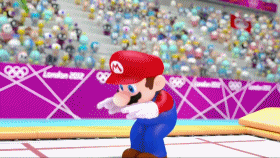

# Modern Olympic Games Analysis

## Introduction

Inspired by the Ancient Greek games, the modern-day Olympics began in 1896, ceremoniously hosted in Athens, Greece. Governed by the International Olympics Committee (founded in 1894), the modern Olympics Games have grown and evolved tremendously over the past 124, subject to cultural, political, and social influence from international participants across the world. An epicenter of both global cooperation and conflict, the Olympic Games reflect and inform the state of our international relationships. From doping to boycotts, terrorism to treaties, the Olympic Games has faced its fair share of obstacles throughout its history. Starting with a mere 12 nations in 1896, the summer Olympic Games now host over 200 countries every four years. Introduced in 1924, the winter Olympic Games increased the size of the Olympic program tremendously, but eventually split from the summer games in 1992. Now, each set of games alternates in occurrence, hosted every four years, but two years apart in that cycle. Additional changes have occurred as a result of the political, economic, and technological growth of our society, allowing the Olympic Games to become a catalyst for social change and human rights movements. Throughout this process, athletes from across the world, now representing nearly every nation, have the opportunity to represent their homeland. Additionally, host countries gain the opportunity to boast their status by showcasing their city to the rest of the world.

In this project, we conduct a comprehensive analysis of the modern Olympic Games from 1896 until the present, using data from each participant with the following features:

    * Name
    * Sex
    * Age
    * Height
    * Weight
    * Team
    * NOC
    * Games
    * Year
    * Season
    * City
    * Sport
    * Event
    * Medal
    
Through this analysis, our goal will be to reveal insights about the Olympic Games, particularly with regards to changes over time, differences between types of athletes, and the ways in which the games inform our international relations.

## Objectives

Throughout this project we will aim to answer the following questions, as divided into the following notebooks:

1. Introduction
    * How can we scrub and prepare our data for further analysis?
    
2. Gender
    * What is the overall gender composition of the Olympic Games?
    * Are height, weight, and age of male and female athletes substantially different?
    * How has the proportion of male and female athletes changed over time?
    * Which countries boast the greatest gender equality based on female participation?
    * Can we predict an athlete's gender based on their height, weight, and age?
    
3. Types of Athletes
    * Which sports have had the most athletes over time?
    * How do the average age, height, and weight differ for athletes of each sport?
    * What trends exist in the height-weight correlation and BMI for athletes of each sport?
    * Are basketball players' heights significantly greater than other athletes?
    * Are rythmic gymnasts significantly lighter than other athletes?
    
4. Olympic Medalists
    * What are the average characteristics of Olympic medalists?
    * How have the average characteristics of Olympic medalists changed over time?
    * Do characteristics of Olympic medalists differ significantly from non-medalists?
    * Which individuals have received the most medals?
    * Who are our youngest and oldest medalists?
    * Which sports have produced the most medalists over time?
    
5. Exploring Countries
    * How do we account for countries with multiple NOC codes throughout history?
    * Which countries have won the most Olympic medals total?
    * Which countries have the highest proportion of athletes winning medals?
    * How can we visualize medal data for each country with plotly choropleth maps?
    * How has the number of participating countries changed over time?
    * How has the number of athletes from our top participating countries changed over time?

6. Seasonal Athletes
    * Is there a significant height difference between summer and winter athletes?
    * Is there a significant weight difference between summer and winter athletes?
    * Is there a significant age difference between summer and winter athletes?
    
7. Trends Over Time
    * How have athlete age, height, and weight changed over time?
    * How has country participation changed over time?
    * Which countries have participated in the highest number of Olympic Games?
    * Which countries have participated in the highest number of summer and winter Olympic Games?
    * How has the overall size of the Olympic Games changed over time?

## Data Science Process

Across the scope of the project, we touch upon various components of our data science process, depending on the research question at hand. However, the overall project from start to finish adheres to the OSEMN framework:

1. **O**btain
2. **S**crub
3. **E**xplore 
4. **M**odel
5. I**n**terpret

## Summary
