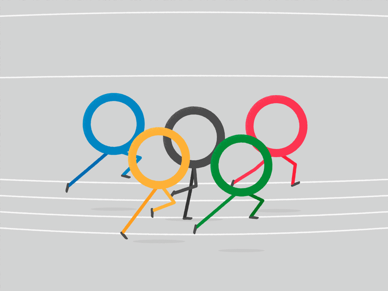

# Modern Olympic Games Analysis

## Introduction

## Objectives

Throughout this project we will aim to answer the following questions, as divided into the following notebooks:

1. Introduction
    * How can we scrub and prepare our data for further analysis?
    
2. Gender
    * What is the overall gender composition of the Olympic Games?
    * Are height, weight, and age of male and female athletes substantially different?
    * How has the proportion of male and female athletes changed over time?
    * Which countries boast the greatest gender equality based on female participation?
    * Can we predict an athlete's gender based on their height, weight, and age?
    
3. Types of Athletes
    * Which sports have had the most athletes over time?
    * How do the average age, height, and weight differ for athletes of each sport?
    * What trends exist in the height-weight correlation and BMI for athletes of each sport?
    * Are basketball players' heights significantly greater than other athletes?
    * Are rythmic gymnasts significantly lighter than other athletes?
    
4. Olympic Medalists
    * What are the average characteristics of Olympic medalists?
    * How have the average characteristics of Olympic medalists changed over time?
    * Do characteristics of Olympic medalists differ significantly from non-medalists?
    * Which individuals have received the most medals?
    * Who are our youngest and oldest medalists?
    * Which sports have produced the most medalists over time?
    
5. Exploring Countries
    * How do we account for countries with multiple NOC codes throughout history?
    * Which countries have won the most Olympic medals total?
    * Which countries have the highest proportion of athletes winning medals?
    * How can we visualize medal data for each country with plotly choropleth maps?
    * How has the number of participating countries changed over time?
    * How has the number of athletes from our top participating countries changed over time?

6. Seasonal Athletes
    * Is there a significant height difference between summer and winter athletes?
    * Is there a significant weight difference between summer and winter athletes?
    * Is there a significant age difference between summer and winter athletes?
    
7. Trends Over Time
    * How have athlete age, height, and weight changed over time?
    * How has country participation changed over time?
    * Which countries have participated in the highest number of Olympic Games?
    * Which countries have participated in the highest number of summer and winter Olympic Games?
    * How has the overall size of the Olympic Games changed over time?

## Data Science Process

Across the scope of the project, we touch upon various components of our data science process, depending on the research question at hand. However, the overall project from start to finish adheres to the OSEMN framework:

1. **O**btain
2. **S**crub
3. **E**xplore 
4. **M**odel
5. A**n**alyze

### Final Project Requirements

Congratulations on making it to module 5! It's been a long journey, but we can finally see the light at the end of the tunnel!

<strong><em>Actual Footage of you seeing the light at the end of the tunnel</strong></em>

Now that you've learned everything we have to teach you, it's time to show off and flex your data science muscles with your own **_Capstone Project_**! This project will allow you to showcase everything you've learned as a data scientist to by completing a professional-level data science project of your choosing. This project will be significantly larger than any project you've completed so far, and will be the crown jewel of your portfolio. A strong capstone project is the single most important thing you can do to get the attention of potential employers, so be prepared to put as much effort into this project as possible--the results are **_worth it!_**

<strong><em>Your <s>milkshake</s> portfolio brings all the <s>boys</s> employers to <s>the yard</s> your inbox! </strong></em>

Let's take a look at the project requirements.

### Technical Requirements

Your project must meet the following technical requirements:

1. **_No Off-The-Shelf Datasets_**. This project is a chance for you to highlight your critical thinking and data gathering skills by finding the perfect dataset to answer your question. If a pre-existing dataset exists that you'd like to use, it is okay to use it in your project. However, you should consider combining it with other existing sources of data, modifying the dataset through feature engineering. The goal here is to showcase your ability to find and work with data, so just grabbing Boston Housing Dataset or the MNIST dataset is out of the question. 

2. **_Strong Data Exploration, with at least 4 relevant data visualizations._** Think of this project as a way for you to showcase your best possible work in every area that matters. There are few skills that impress employers more than the ability to dive into a new dataset and produce engaging visualizations that communicate important information. For this project, anything worth knowing is worth visualizing. Consider all that you have learned, and don't be afraid to dig into more advanced visualization libraries like seaborn to see what you make! You should make use of visualizations whenever possible during this project, not just during the Data Exploration phase--for instance, consider visualizing your confusion matrices rather than just printing them out as text!

### Deliverables
    1. An **_Abstract_** section that briefly explains your problem, your methodology, and your findings, and business recommendations as a result of your findings. This section should be 1-2 paragraphs long.  
    2. The technical analysis for a data science audience. This detailed technical analysis should explicitly follow a Data Science Process as outlined in the previous section. It should be well-formatted and organized, and should contain all code, visualizations, and detailed explanations/analysis.

## Summary
